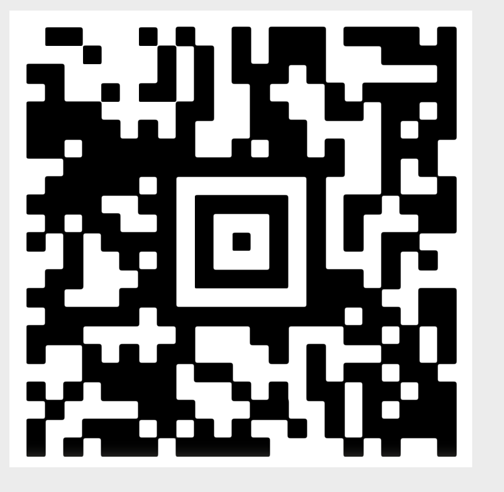

# HV19.02 Triangulation

https://academy.hacking-lab.com/events/6/challenges/38

The `Triangulation.stl` can be opened on my Mac with Xcode. It shows a christmas ball.  
As I've never worked in this environment with 3D models, I am zooming around and find quickly that the QR code is hidden as a 3D model inside the christmas ball.
So I'll have to get rid of the "outside"to be able to capture it in its entierty. I created `QR.stl`.

Using the open source 3D software [Blender](https://www.blender.org) I was able to import the STL file and carefully delete all the vertices belonging to the christmas ball/hull. The resulting QR code couldn't be scanned with my iPhone camera app... 

after trying to fix things (there was a missing vertice in the code making a small part non-square), I found out that the issue is not the data but my scanner: it seems as if the iPhone camera app doesn't read Aztec codes.

With the help of https://online-barcode-reader.com I was able to decode the message:

    **19{Cr4ck_Th3_B411!}

The HV19 in the beginning was missing... therefore I had to amend this and was successfull with
    
    HV19{Cr4ck_Th3_B411!}

