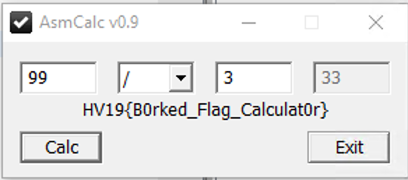

# HV19.16 B0rked Calculator

https://academy.hacking-lab.com/events/6/challenges/84

Again a windows binary, this time a calculator whos operations are missing.
I have to start up my Windows Dev environment again :-(

I installed Java JDK and Ghidra to learn about the reverse engineering tool.
It has great capabilities which allows to quickly find the missing functions (`NOP` operations in the assembly code).

To fix the binary, the `add`, `sub`, `mul` and `div` operations have to be implemented. Luckily there is a small (tutorial about IA32 assembly arithmetic)[https://www.tutorialspoint.com/assembly_programming/assembly_arithmetic_instructions.htm] which gives an idea how it works.
And to get the operand from the stack into EAX and ECX registers, there are already examples in the `add` & `sub` operation stubs implemented.

The code patch for the functions written in Ghidra is 

```asm
                            **************************************************************
                            *                          FUNCTION                          *
                            **************************************************************
                            int __stdcall FUN_add(int val1, int val2)
            int               EAX:4          <RETURN>
            int               Stack[0x4]:4   val1                                    XREF[1]:     004015ba(R)  
            int               Stack[0x8]:4   val2
                            FUN_add                                         XREF[3]:     00401470(c), 
                                                                                        FUN_decode_flag:00401527(c), 
                                                                                        FUN_decode_flag:00401571(c)  
    004015b6 c8 00 00 00     ENTER      0x0,0x0
    004015ba 8b 45 08        MOV        EAX,dword ptr [EBP + val1]
    004015bd 03 45 0c        ADD        EAX,dword ptr [EBP + 0xc]
    004015c0 c9              LEAVE
    004015c1 c2 08 00        RET        0x8
                            **************************************************************
                            *                          FUNCTION                          *
                            **************************************************************
                            int __stdcall FUN_sub(int val1, int val2)
            int               EAX:4          <RETURN>
            int               Stack[0x4]:4   val1
            int               Stack[0x8]:4   val2                                    XREF[1]:     004015cb(R)  
                            FUN_sub                                         XREF[3]:     0040148c(c), 
                                                                                        FUN_decode_flag:0040153b(c), 
                                                                                        FUN_decode_flag:00401585(c)  
    004015c4 c8 00 00 00     ENTER      0x0,0x0
    004015c8 8b 45 08        MOV        EAX,dword ptr [EBP + 0x8]
    004015cb 8b 4d 0c        MOV        ECX,dword ptr [EBP + val2]
    004015ce 29 c8           SUB        EAX,ECX
    004015d0 c9              LEAVE
    004015d1 c2 08 00        RET        0x8
                            **************************************************************
                            *                          FUNCTION                          *
                            **************************************************************
                            int __stdcall FUN_mul(int val1, int val2)
            int               EAX:4          <RETURN>
            int               Stack[0x4]:4   val1
            int               Stack[0x8]:4   val2
                            FUN_mul                                         XREF[3]:     004014a8(c), 
                                                                                        FUN_decode_flag:0040155d(c), 
                                                                                        FUN_decode_flag:00401596(c)  
    004015d4 c8 00 00 00     ENTER      0x0,0x0
    004015d8 8b 45 08        MOV        EAX,dword ptr [EBP + 0x8]
    004015db 8b 4d 0c        MOV        ECX,dword ptr [EBP + 0xc]
    004015de f7 e1           MUL        ECX
    004015e0 c9              LEAVE
    004015e1 c2 08 00        RET        0x8
                            **************************************************************
                            *                          FUNCTION                          *
                            **************************************************************
                            int __stdcall FUN_div(int val1, int val2)
            int               EAX:4          <RETURN>
            int               Stack[0x4]:4   val1
            int               Stack[0x8]:4   val2
                            FUN_div                                         XREF[2]:     004014c4(c), 
                                                                                        FUN_decode_flag:0040154c(c)  
    004015e4 c8 00 00 00     ENTER      0x0,0x0
    004015e8 8b 45 08        MOV        EAX,dword ptr [EBP + 0x8]
    004015eb 8b 4d 0c        MOV        ECX,dword ptr [EBP + 0xc]
    004015ee 31 d2           XOR        EDX,EDX
    004015f0 f7 f1           DIV        ECX
    004015f2 c9              LEAVE
    004015f3 c2 08 00        RET        0x8
```

The corresponding byte patch for x64dbg is

```
>b0rked.exe
000015BD:90->03
000015BE:90->45
000015BF:90->0C
000015C8:90->8B
000015C9:90->45
000015CA:90->08
000015CE:90->29
000015CF:90->C8
000015D8:90->8B
000015D9:90->45
000015DA:90->08
000015DB:90->8B
000015DC:90->4D
000015DD:90->0C
000015DE:90->F7
000015DF:90->E1
000015E8:90->8B
000015E9:90->45
000015EA:90->08
000015EB:90->8B
000015EC:90->4D
000015ED:90->0C
000015EE:90->31
000015EF:90->D2
000015F0:90->F7
000015F1:90->F1
```


After fixing all the instructions, the calculator automatically shows the flags:



    HV19{B0rked_Flag_Calculat0r}
