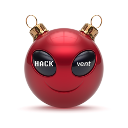

# HACKvent 2019 - The hackers advent

https://hackvent.hacking-lab.com

https://academy.hacking-lab.com/events/6

Here I have added links to all my learnings and notes for HACKVent 2019, where I finished with 3230 points on 68th place.

- HV19.01 censored [my solution](01/)
- HV19.02 Triangulation [my solution](02/)
- HV19.03 Hodor, Hodor, Hodor [my solution](03/)
- HV19.04 password policy circumvention [my solution](04/)
- HV19.05 Santa Parcel Tracking [my solution](05/)
- HV19.06 bacon and eggs [my solution](06/)
- HV19.H1 Hidden One [my solution](H1/)
- HV19.07 Santa Rider [my solution](07/)
- HV19.H2 Hidden Two [my solution](H2/)
- HV19.08 SmileNcryptor 4.0 [my solution](08/)
- HV19.09 Santas Quick Response 3.0 [my solution](09/)
- HV19.10 Guess what [my solution](10/)
- HV19.11 Frolicsome Santa Jokes API [my solution](11/)
- HV19.H3 Hidden Three [my solution](H3/)
- HV19.12 back to basic [my unfinished solution](12/)
- HV19.13 TrieMe [my solution](13/)
- HV19.14 Achtung das Flag [my solution](14/)
- HV19.H4 Hidden Four [my solution](H4/)
- HV19.15 Santa's Workshop [my solution](15/)
- HV19.16 B0rked Calculator [my solution](16/)
- HV19.17 Unicode Portal [my solution](17/)
- HV19.18 Dance with me [my unfinished solution](18/)
- HV19.19 🎅 [my solution](19/)
- HV19.20 i want to play a game [my unfinished solution](20/)
- HV19.21 Happy Christmas 256
- HV19.22 The command ... is lost
- HV19.23 Internet Data Archive
- HV19.24 ham radio
- HV19 Writeup
